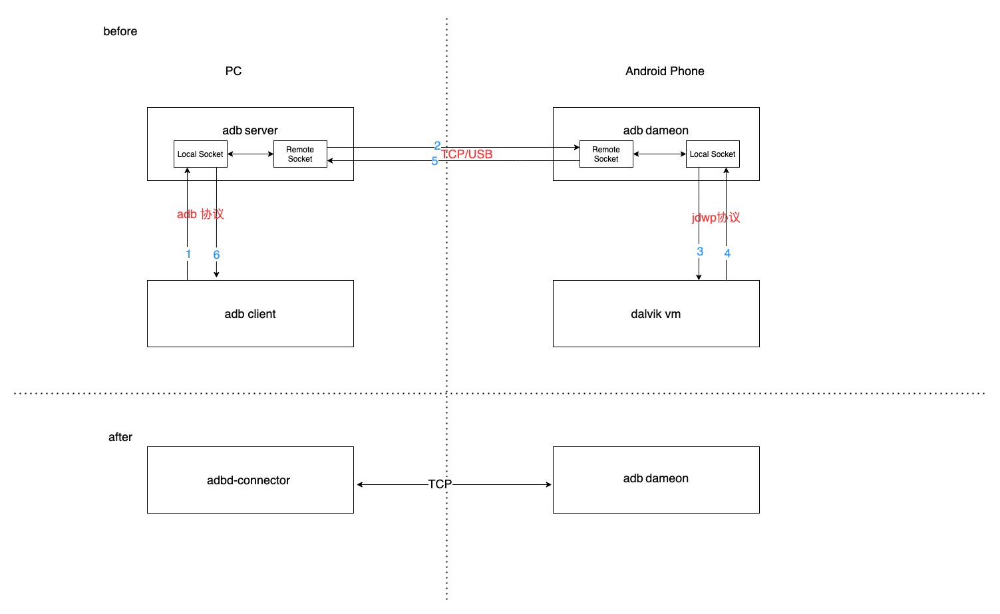

# adbd-connector

这是一个实现 adb server 和 adb daemon 之间的通信协议的库。

## 背景

下图中的 adb client 和 adb server 都共存在 PC 中，PC 上安装过 adb 程序就会有。adb dameon (简称adbd)是存在于 Android 手机中的一个进程/服务。

当我们启动命令行输入 adb 命令时，实际上使用的是 adb client，它会跟 PC 本地的 adb server 进行通信（当然，有一个前提先要使用 adb-start 启动 adb server 才能调用 adb 命令）。

然后 adb server 会跟 Android 手机进行通信（手机通过 usb 口连上电脑）。最终，我们会看到 adb client 返回命令执行的结果。

一次命令的执行包含了 1-6 个步骤。其实，还要算上 adb server 内部的通信和 adb dameon 内部的通信。一次命令的执行，路径会很长。

其实，在 adb server 和 adbd 之间有一个 TCP 的传输协议，它定义在 Android 源码的 system/core/adb/protocol.txt 文件中。只要是能通过 adb 命令连接的手机，都会遵循这个协议，无论是 Android 或是鸿蒙系统。

因此，基于这个协议实现了一个 TCP 的客户端(adbd-connector)就可以跟手机的 adbd 服务/进程进行通信，从而实现 adb 的所有指令。

另外，我还使用 Kotlin Compose Desktop 在这个协议上做了一层 UI，实现了一个在 PC 上的简易"手机助手"，且支持 Mac、Windows、Linux。

> 连接前，确保手机和电脑在同一个局域网。然后打开手机的开发者模式，以及 5555 端口使用 adb 命令：adb tcpip 5555

## 手机的连接效果：

## 执行 adb shell 命令的效果：

## install app 
需要分成2步：
1. 使用 push 命令将 apk 推送到手机的目录 /data/local/tmp/
2. 使用 adb shell pm install 命令进行安装

## uninstall app

adb shell pm uninstall 包名 

## reverse

将 TCP 端口从安卓设备中映射到 localhost

adb reverse tcp:{{远程端口}} tcp:{{本地端口}}