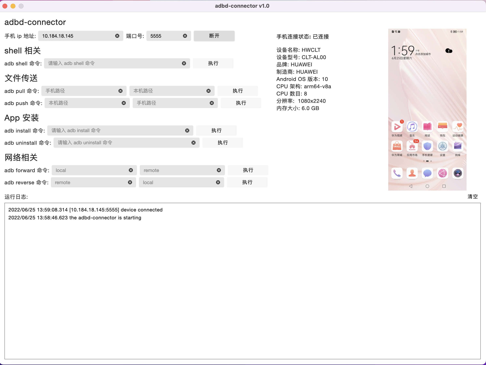
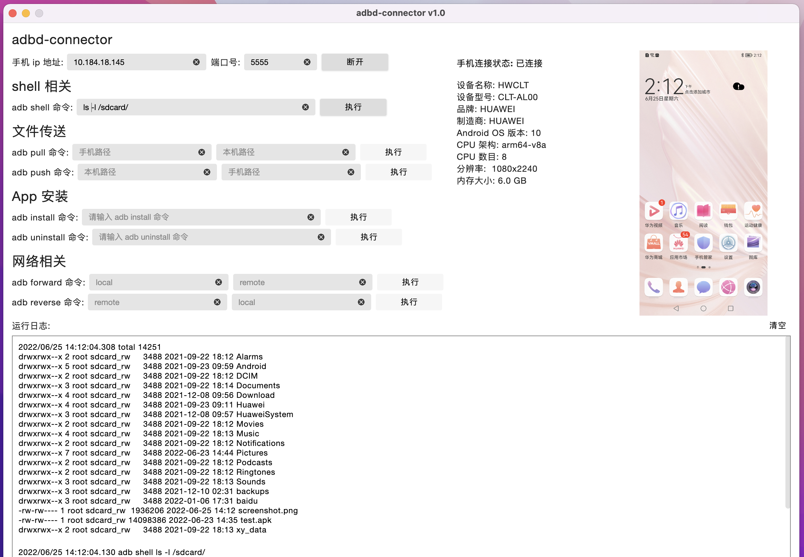
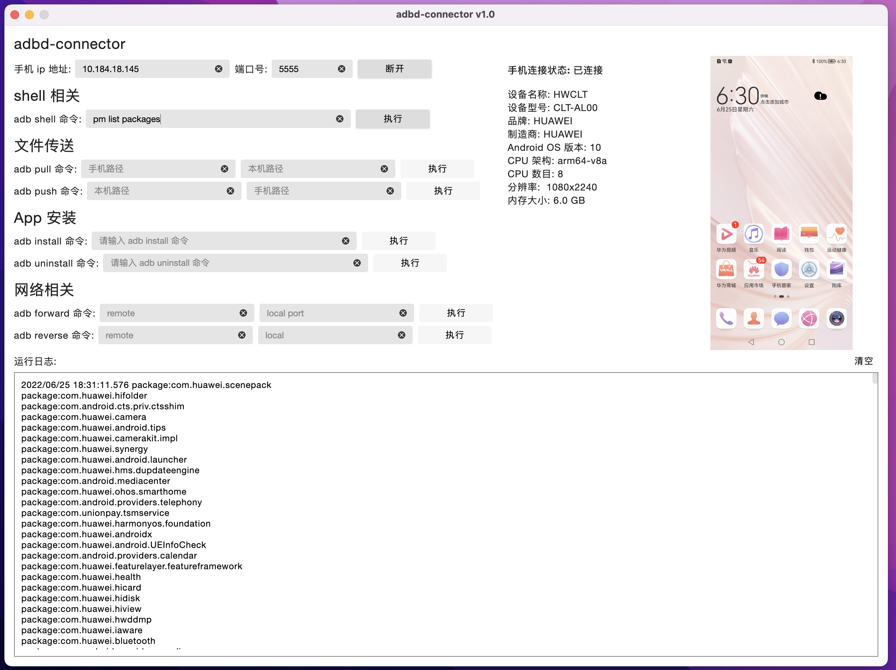

# adbd-connector

基于 ADB Server 和 ADB Daemon 之间的通信协议，实现的库。

使用 Kotlin Compose Desktop 做了一层 UI 可以在 PC 上使用的简易"手机助手"，支持 Mac、Windows、Linux。

连接前，确保手机和电脑在同一个局域网。然后打开手机的开发者模式，以及 5555 端口使用 adb 命令：adb tcpip 5555

## 手机的连接效果：

## 执行 adb shell 命令的效果：

## install app 
需要分成2步：
1. 使用 push 命令将 apk 推送到手机的目录 /data/local/tmp/
2. 使用 adb shell pm install 命令进行安装

## uninstall app

adb shell pm uninstall 包名 

## reverse

将 TCP 端口从安卓设备中映射到 localhost

adb reverse tcp:{{远程端口}} tcp:{{本地端口}}